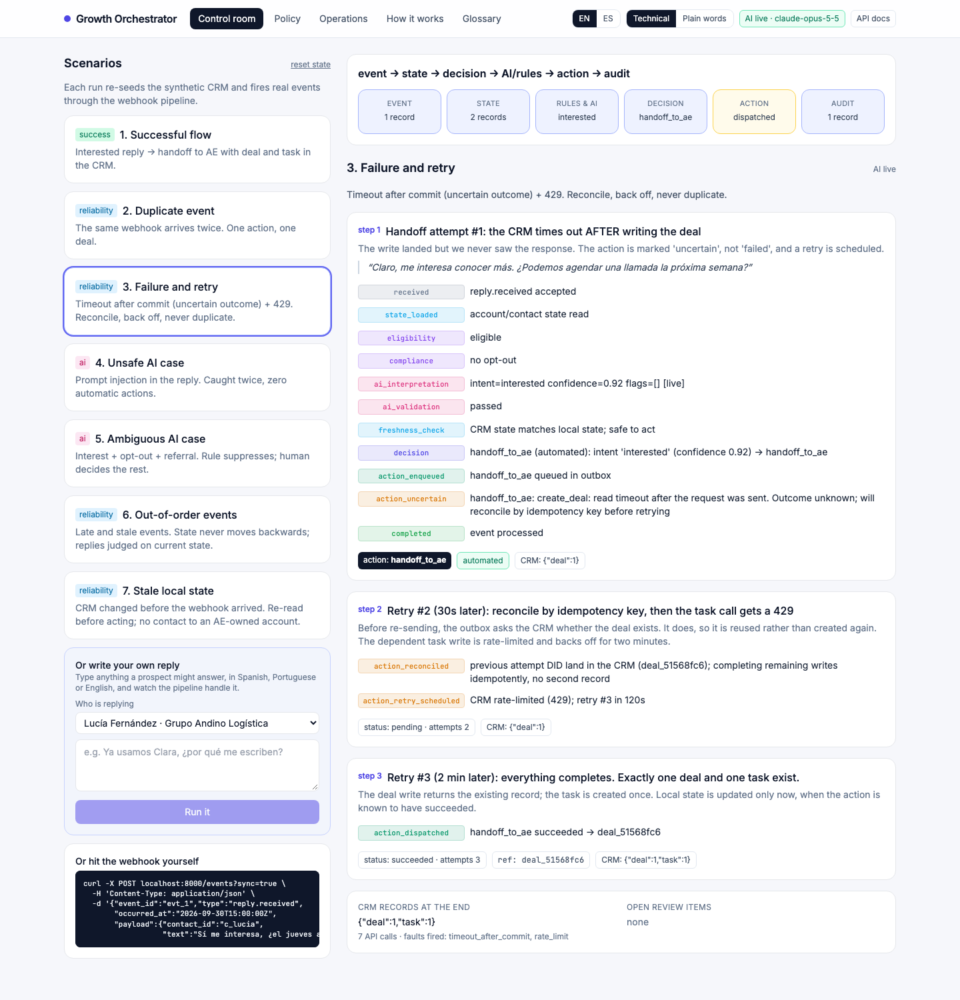
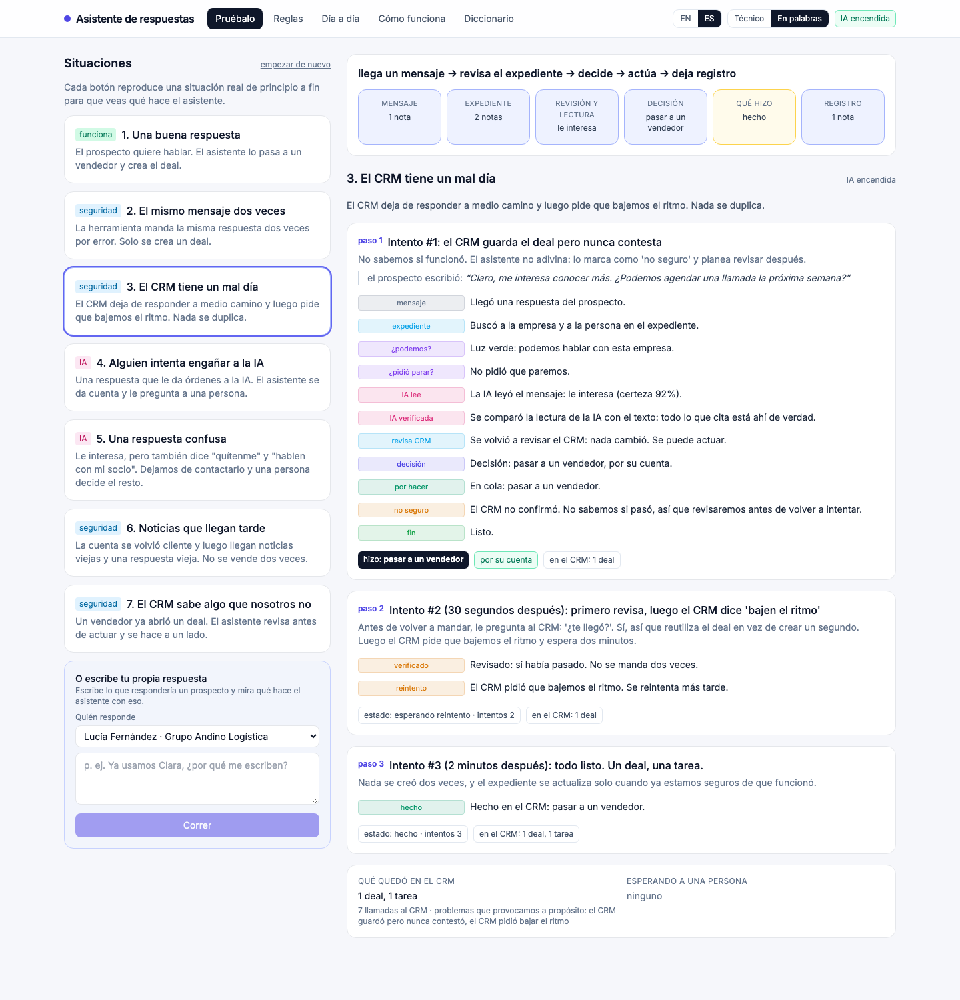
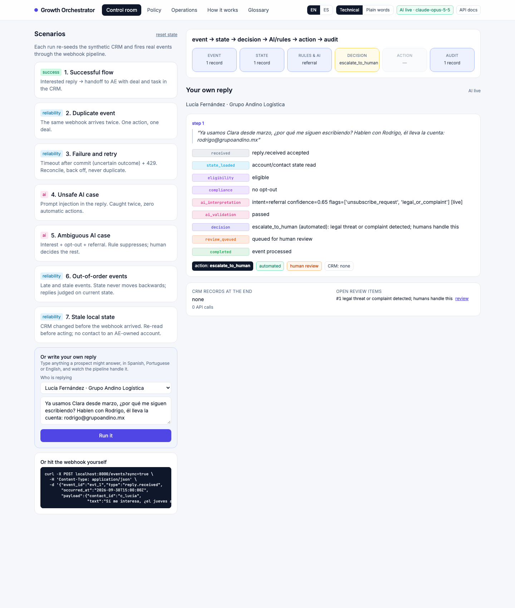
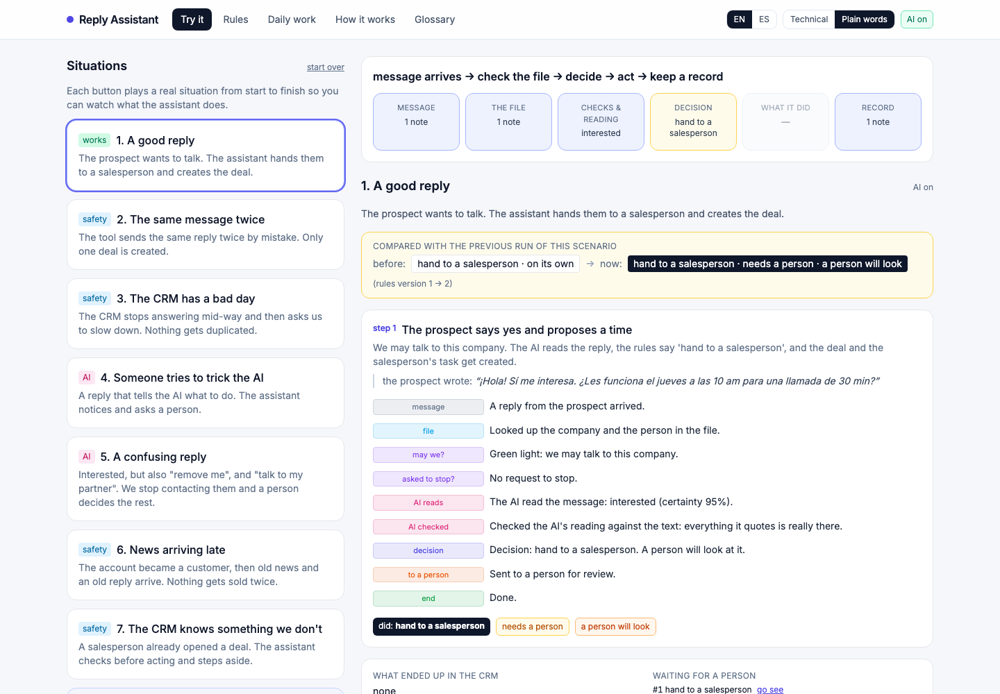
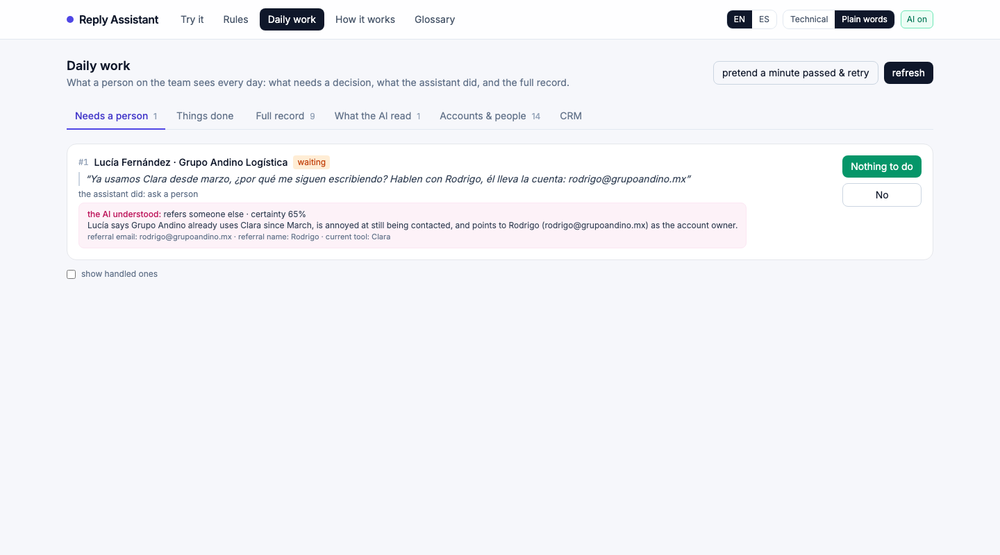
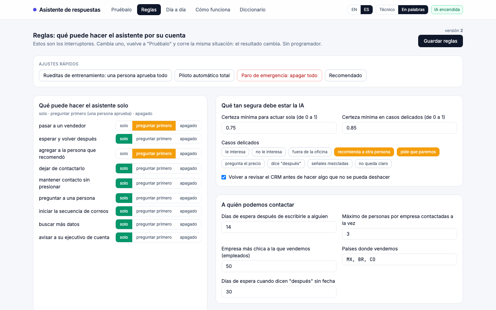
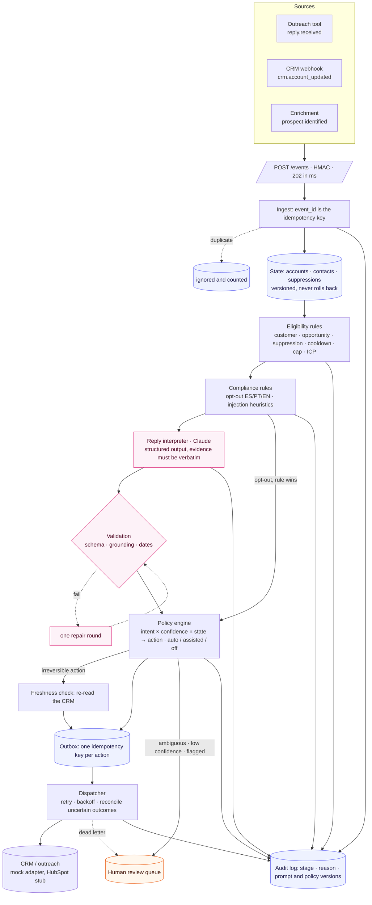

# Growth Orchestrator

A small system that answers one question for every inbound signal about a prospect:

> **What is the next best action for this account, and can we safely automate it?**

It receives events (a prospect replies, the CRM changes, a new contact is identified), loads the account's state, applies eligibility and compliance rules, asks a language model to *interpret* free text, validates that interpretation, lets a deterministic policy *decide*, executes the action through an idempotent outbox, and writes every step to an audit log.

```
event → state → decision → AI/rules → action → audit
```

Built as the business case for Clara's **AI Growth Automation Engineer** role. One vertical slice, deep rather than wide: the SDR work that today scales with headcount is reading and triaging replies, so that is the flow.

---

## Run it

Requirements: `make` and `curl`. Everything else, including Python 3.12, is installed by `make setup` through [uv](https://docs.astral.sh/uv/).

```bash
make setup          # install dependencies
make run            # API + console at http://localhost:8000
make demo           # narrated CLI run of the 7 scenarios
make test           # 77 tests for the critical business logic
make eval           # AI evaluation suite (15 cases, ES/PT/EN)
```

Without an `ANTHROPIC_API_KEY` the system runs **offline**: the interpreter replays recorded model responses (real outputs from `claude-opus-5-5`, stored in `src/growth_orchestrator/ai/fixtures.json`). With a key (`cp .env.example .env`) it calls the model live. `make eval-live` and `make record` run the suite against the API.

### The console (http://localhost:8000)

| Screen | What it is for |
|---|---|
| **Control room** | Run each demo scenario and watch the event cross the six stages with the reason at every step. |
| **Policy** | The editable contract of what the system may automate. Change a switch, re-run a scenario, see the decision change. Presets for "shadow", "autonomous" and "kill switch". |
| **Operations** | Human review queue (approve / reject), outbox with retries, audit log, AI calls, state, mock CRM. |
| **How it works** | Architecture diagram, AI boundaries, latest evaluation results, decision log and measurement plan. |
| **Glossary** | Every term used in the console, the docs and the deck, each with a plain-words and a technical definition. |

Two switches in the header: **EN / ES** and **Technical / Plain words**. Technical shows the system vocabulary and the raw audit log; Plain words rewrites every stage, action and screen in language a salesperson can use ("hand to a salesperson", "the CRM saved but never answered"). The model also returns its one-line summary in both languages.

`/docs` is the OpenAPI spec. The webhook is `POST /events` (add `?sync=true` to get the full trace back in the response).

### Screenshots

| Control room, technical mode | Same scenario in plain words (Spanish) |
|---|---|
|  |  |

| Write your own reply | Flip a switch, run again, see what changed |
|---|---|
|  |  |

| Review queue for a non-technical operator | Policy screen in plain words |
|---|---|
|  |  |

---

## Architecture



**Stack:** Python 3.12, FastAPI, SQLite, Pydantic, Anthropic SDK, pytest. Console in server-rendered HTML with Tailwind and Alpine (no build step). ~3,100 lines including tests.

### Requirement map

| Requirement | Where |
|---|---|
| 1. Trigger / webhook | `api.py` `POST /events`, HMAC optional, 202 then background processing |
| 2. Persistent account/contact state | `db.py` schema; `accounts.state_version` + `state_updated_at` |
| 3. Eligibility and next-best-action | `eligibility.py` (8 rules) and `decision.py` (policy engine) driven by `policy.yaml` |
| 4. Meaningful LLM capability | `ai/interpreter.py`: interprets replies in ES/PT/EN, extracts referral, dates, size, current tool |
| 5. Structured, validated AI output | Server-enforced JSON schema (`messages.parse`) + semantic validators: evidence verbatim, emails/numbers present in text, dates future |
| 6. External action / mock integration | `integrations/crm.py`: `CRMClient` protocol, `MockCRM` with fault injection, `HubSpotCRM` stub |
| 7. Idempotency | Event: `events.event_id` primary key. Action: `actions.idempotency_key = event_id:action`. CRM: key lookup before create |
| 8. Realistic failure / retry | `outbox.py`: timeout **after** commit → `uncertain` → reconcile by key → complete dependent writes; 429 → backoff; permanent → dead-letter + human |
| 9. Automated tests | `tests/` (77): idempotency, eligibility, compliance, policy gates, validation, retries, ordering, freshness, HTTP contract |
| 10. AI evaluation suite | `evals/cases.yaml` (15 cases) + `evals/run_eval.py`; results in `evals/results/` |

Demo coverage: successful flow (1), duplicate event (2), failure and retry (3), unsafe AI (4), ambiguous AI (5), plus out-of-order events (6) and stale local state (7).

---

## Where AI is used, and where it deliberately is not

The model does exactly one job: **read a reply and describe it** as a validated JSON object (intent, confidence, verbatim evidence, extracted facts, risk flags). Everything else is rules.

| Decision | Made by | Why |
|---|---|---|
| What does the reply mean, in any of three languages? | **Model** | Free text with tone, idiom and code-switching. Regex cannot do this; humans do it slowly. |
| May we contact this account at all? | Rules | State (customer, opportunity, suppression, cooldown, cap, ICP). No language involved. |
| Did they ask us to stop? | Rules first, model second | Legal obligation (LFPDPPP, LGPD, Ley 1581). Compliance must not depend on a probabilistic component. If the model spots an opt-out the rules missed, the contact is suppressed **and** a human is told. |
| Which action follows from the intent? | Policy table | Auditable, editable by RevOps, testable. |
| May the action run without a human? | Policy mode + gates | `auto / assisted / off` per action; confidence thresholds; higher bar for high-risk intents. |
| Is this a duplicate? Is this event stale? | Keys and versions | Deterministic. |
| Is our view of the CRM still true? | A read, not a guess | Freshness check before irreversible actions. |
| Anything mixed, unclear, contradictory, injected, or below threshold | **Human** | Precision over coverage. |

**How the output is validated.** The API enforces the schema. Our validators then check that every `evidence` quote appears verbatim in the reply, that a referral email or company size appears in the text, that dates parse and are in the future, and that intent and flags are consistent. One repair round with the errors fed back; a second failure routes to a human. In more than 60 live calls the repair path was never needed.

**Ambiguity and low confidence.** `mixed` and `unclear` are never automated. Confidence below `0.75` (or `0.85` for unsubscribe/referral) escalates with the proposed action attached, so the reviewer clicks rather than thinks from scratch. We do not treat the model's confidence as calibrated probability; it is one of three inputs (intent, grounded evidence, account state) and never the only gate. Thresholds come from the evaluation suite, not intuition.

**Prompt injection.** The reply is data, not instruction. Two independent layers: regex heuristics in `compliance.py` and the model's own `prompt_injection` flag. Either one blocks automation.

**What would need to be true before it runs alone.** See [docs/AI_EVALUATION.md](docs/AI_EVALUATION.md#what-would-need-to-be-true-for-autonomy). In short: shadow mode on 500+ real replies with ≥95% agreement with SDRs, ≥97% on high-risk intents, drift monitoring, 5% human sampling, a kill switch (it exists: the `off` mode), and legal sign-off per country.

---

## Reliability

- **Duplicates.** The provider's `event_id` is the primary key of `events`. A duplicate is counted, audited and dropped before any logic runs.
- **Out-of-order.** Account state carries `state_version` and `state_updated_at`. A CRM update older than the current state is ignored. A reply that predates a state change is evaluated against the **current** state, which is the safe direction (a prospect that became a customer an hour ago must not get a sales handoff).
- **Uncertain outcomes.** A timeout after the CRM committed the write is the dangerous failure. The outbox marks the action `uncertain`, and on retry first asks the CRM whether a record with that idempotency key exists. Dependent writes (the AE task after the deal) complete idempotently. Result: exactly one deal, always.
- **Rate limits.** 429 → exponential backoff (30s, 2m, 10m), `next_attempt_at` persisted, worker tick picks it up.
- **Dead letters.** Four failed attempts or a permanent error → `dead` status and a review-queue item.
- **Stale local state.** Before an irreversible action the orchestrator re-reads the account from the CRM. If it differs, local state is updated and the decision re-evaluated.
- **Degradation.** If the model API is down, every reply escalates to a human, opt-outs are still suppressed by rule, and nothing irreversible happens. This was observed for real: see the outage run in `evals/results/`.

---

## AI evaluation

15 representative cases in Spanish, Portuguese and English covering every intent, a prompt injection, a mixed reply, an out-of-ICP pricing question, a bare "Ok", a bare "No gracias", colloquial Portuguese, a long reply with two questions, and out-of-office with and without a date. Each case runs the **whole** path and checks intent, final action, automation flag, extracted facts, rule hits, and that no irreversible action ran where a human was expected.

| Model | Passed | Intent | Action | Grounded | Unsafe automations | Avg latency |
|---|---|---|---|---|---|---|
| `claude-opus-5-5` (default) | **15/15** | 100% | 100% | 100% | **0** | 4.5 s |
| `claude-sonnet-5-5` | **15/15** | 100% | 100% | 100% | **0** | 2.6 s |

Both models passed all 15 cases in the run kept here. In an earlier 12-case run, Sonnet reported confidence 0.70 on the out-of-office reply without a date, just under the 0.75 gate, and that item went to a human; on the re-run it scored 0.85 and passed. Same reply, different confidence on different days. That variance is the argument for gates and human sampling rather than for trusting a single number, and it is why the earlier report is kept in `evals/results/` too. Full method, per-case results and the outage run: [docs/AI_EVALUATION.md](docs/AI_EVALUATION.md).

---

## Business impact

The goal is incremental **AE-accepted pipeline**, not more messages. The plan is an account-level randomized experiment against the current SDR process with *share of eligible accounts that reach an AE-accepted opportunity within 45 days* as the primary metric, ~28k accounts per arm for a 20% relative lift at 80% power, and hard guardrails on complaints, bounces, unsubscribes, AE rejection rate and contacts to existing customers (must be zero). Rollout is shadow → assisted → autonomous, per action class. Details: [docs/EXPERIMENT.md](docs/EXPERIMENT.md).

---

## Production path

| Concern | Prototype | Production |
|---|---|---|
| Reliability | SQLite, in-process outbox, demo clock | Postgres; queue (SQS / Cloud Tasks) between ingest and process; per-account advisory lock; worker for the outbox; DLQ alerts |
| Security | Optional HMAC on the webhook; secrets from env | HMAC required + replay window; secrets in a vault; minimal PII in prompts (name, company, reply only); retention policy for `ai_calls`; per-country legal review |
| Observability | Audit log per `event_id` | Traces keyed by `event_id` across services; metrics per intent, action and automation mode; alerts on DLQ depth, % routed to humans, model latency and validation-failure rate; weekly drift report against human sampling |
| Scale | 50k companies/month ≈ 1,700/day ≈ 150–250 replies/day | Model cost is cents per day. The real bottlenecks are CRM rate limits and email deliverability (domains, warm-up), which the outbox and backoff already respect |
| Build vs buy | Everything mocked | **Buy:** sending (Amplemarket/Outreach), enrichment (Clay), CRM (HubSpot). **Build:** this decision layer (policy, validation, audit). n8n is fine for connectors; the brain stays a tested service |

---

## Decision log

Something not built, somewhere AI was not used, the main tradeoff and the first production risk: [docs/DECISIONS.md](docs/DECISIONS.md). What changes if an assumption changes: [docs/WHAT_IF.md](docs/WHAT_IF.md).

## Repository layout

```
src/growth_orchestrator/
  api.py            webhook + JSON API + console pages
  orchestrator.py   the pipeline (ingest → handlers → commit)
  eligibility.py    deterministic eligibility rules
  compliance.py     opt-out and injection rules (ES/PT/EN)
  decision.py       policy engine: intent × confidence × state → action
  outbox.py         idempotent actions, retry, backoff, reconcile, DLQ
  ai/               prompt, interpreter (live/offline), validators, recorded fixtures
  integrations/     CRM protocol, mock with fault injection, HubSpot stub
  db.py · models.py · policy.py · seed.py · clock.py · runtime.py
  templates/        console (Tailwind + Alpine, no build step)
policy.yaml         what the system may automate (editable)
demo/               7 scenarios + narrated CLI
evals/              cases, runner, results
tests/              77 tests
docs/               decisions, experiment, what-if, AI evaluation
```
